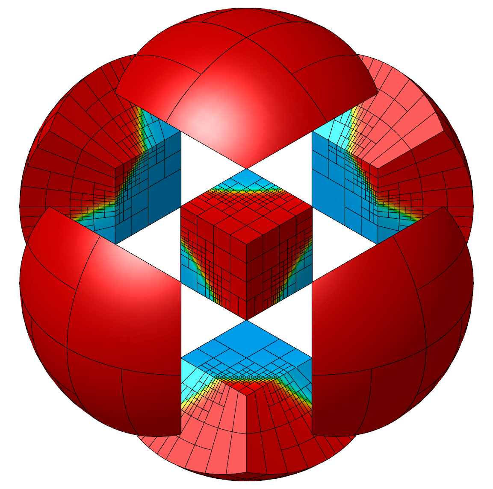
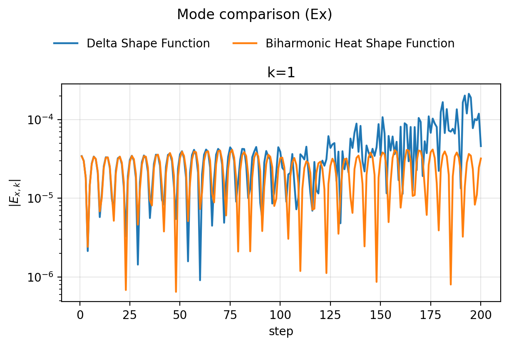

Code

**MFEM Workshop 2026**
# Particle-in-cell in MFEM

Rushan Zhang1 (rzhangbq@gatech.edu), Joseph Signorelli2, Ketan Mittal3, Tzanio Kolev3, Qi Tang1

<em>1Georgia Institute of Technology, 2University of Illinois Urbana-Champaign, 3Lawrence Livermore National Laboratory</em>

### Highlights
- Electrostatic **PIC** on MFEM particle tracing: particles deposit charge, the mesh field pushes them back
- Compatible gradient $\mathrm{CG}\xrightarrow{\nabla_h}\mathrm{ND}$ and **OrthoSolver** for periodic Poisson
- **Biharmonic-heat** shape function: a mesh-compatible low-pass filter applied by solving $u_t+\kappa\Delta^2 u=0$

---

Code

### One PIC time step in MFEM

$$\text{particles}\xrightarrow{\text{deposit}}\text{field}\xrightarrow{\text{push}}\text{particles}$$

1. **Deposit charge.** 
For $\varphi\in H^1(\Omega)$, assemble $e\sum_p\varphi(\mathbf x_p)$.

2. **Solve Poisson.** 
`OrthoSolver` removes the periodic nullspace.

$\displaystyle\epsilon_0\langle\nabla\varphi,\nabla\phi\rangle=e\sum_p\varphi(\mathbf x_p)-en_0\int_\Omega\varphi.$

3. **Compute field.** 
$\langle\mathbf v,\mathbf E+\nabla\phi\rangle=0$ in $H(\mathrm{curl})$.

4. **Gather field.** 
Interpolate $\mathbf E$ at each $\mathbf x_p$.

5. **Leapfrog push.**

$$\begin{aligned}
\mathbf p_p^{t+\frac12\Delta t}&=\mathbf p_p^{t-\frac12\Delta t}+e\mathbf E^t(\mathbf x_p^t)\Delta t,\\
\mathbf x_p^{t+1}&=\mathbf x_p^t+\mathbf p_p^{t+\frac12\Delta t}\Delta t/m_p.
\end{aligned}$$

6. **Redistribute.** 
Exchange particles that cross MPI ranks.

### Low-pass shape function

The shape function is the biharmonic heat kernel at time $\tau$:

$$s_{\mathbf{x}}(\mathbf{x})=E(\mathbf{x},\tau),\qquad \hat{E}(\mathbf{k},\tau)=e^{-\kappa(2\pi/L)^4\|\mathbf{k}\|^4\tau}.$$

Applying $s_{\mathbf{x}}$ is equivalent to convolving the Dirac charge (and the potential) with that kernel:

$$\rho=s_{\mathbf{x}}*\rho_\delta,\qquad \phi_s=s_{\mathbf{x}}*\phi,\qquad \mathbf{E}_p=-\nabla\phi_s(\mathbf{x}_p).$$

